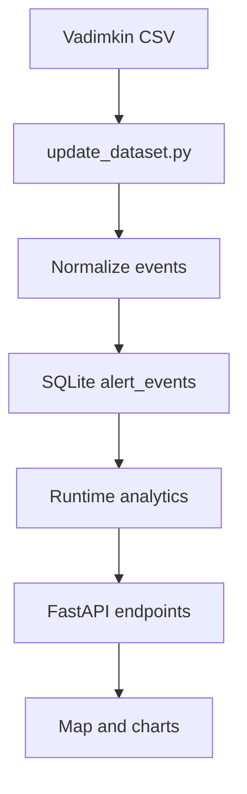

# Architecture

## Stack

- Backend: FastAPI.
- Data processing: Pandas.
- Storage: SQLite.
- ORM: SQLAlchemy.
- Web shell: Jinja2, Leaflet, Chart.js, vanilla JavaScript.

## Structure

```text
uair_raid_analytics/
  api/          HTTP API routes
  analytics/    runtime aggregation and metrics
  data/         dataset refresh and normalization
  web/          HTML templates and static frontend assets
  config.py     environment-based settings
  database.py   SQLAlchemy engine/session setup
  models.py     database tables
  regions.py    Ukraine region reference
```

## Data Flow



## Precompute Strategy

MVP does not precompute aggregates.

This keeps the implementation small and allows the combined index formula to change easily. If runtime queries become slow later, add a summary table behind the same API response shape.
